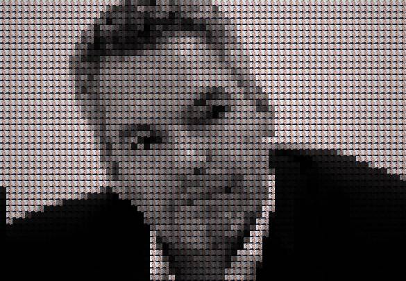
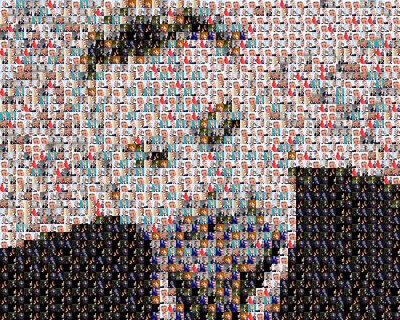

# Collage
Tool to create a collage from a single or mutliple images using stb_image library. For quality results of `multi` collages use more than 100-200 photos.

## Limitations
 - Works only with rgb-images of 3 channels
 - Only writes jpegs

## Examples
||||
|-|-|-|
|Base Image|*single* collage|*multi* collage|

## Usage
|Method|Notes|
|-|-|
|`shrink`|Shrink `input-image` to hardcoded size|
|`single`|Create collage from single image|
|`multi`|Create collage from multiple images|  

<br>

```
Usage:
    collage [..] shrink INPUT_IMAGE OUTPUT_PATH
    collage [..] single INPUT_IMAGE OUTPUT_PATH MODE
    collage [..] multi INPUT_IMAGE IMAGE_FOLDER OUTPUT_PATH COLLAGE_SIZE JPG_QUALITY

arguments:
    INPUT_IMAGE     path to image
    OUTPUT_PATH     ath of output-image to write
    INPUT_FOLDER    path of folder, which images are included in the collage
    MODE    0 = based on INPUT_IMAGE, 1 = circle
    COLLAGE_SIZE    "widthxheight" or "A1", "A2", "A3", "A4"
    JPG_QUALITY     integer between 0 and 100

options:
    -h --help       show help/usage
    -v --verbose    enable verbose logs
    -d --debug      (for multi) write images for every stage in process
```

## TODO 
 - Implement contours (see https://www.sciencedirect.com/science/article/abs/pii/0734189X85900167)
 - Fix broken add_border
 - Exception handling: check malloc for NULL, input validation, etc.
 - Support more than 3 channels
 - refactor collage_from_multiple_images